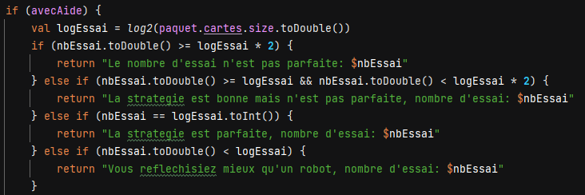
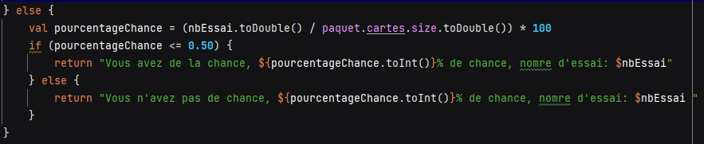

# Projet 0
#### CAFFIAUX Élian et RODRIGUES Loïc

## Challenge 1
Nous avons commencé par vérifier si notre ordinateur possédait une version de git

Ensuite nous avons réaliser les test unitaires de ce qui ne sont pas passer.
Tout d'abord nous avons crées deux paquets de cartes dans la class FrabriqueJeuDeCartes.

Voici les paquets :

        fun createJeu32Cartes() : List<Carte> {
        return listOf(
        Carte(NomCarte.ROI, CouleurCarte.PIQUE),
        Carte(NomCarte.DAME, CouleurCarte.PIQUE),
        Carte(NomCarte.VALET, CouleurCarte.PIQUE),
        Carte(NomCarte.DIX, CouleurCarte.PIQUE),
        Carte(NomCarte.NEUF, CouleurCarte.PIQUE),
        Carte(NomCarte.HUIT, CouleurCarte.PIQUE),
        Carte(NomCarte.SEPT, CouleurCarte.PIQUE),
        Carte(NomCarte.AS, CouleurCarte.PIQUE),
    
        Carte(NomCarte.ROI, CouleurCarte.CARREAU),
        Carte(NomCarte.DAME, CouleurCarte.CARREAU),
        Carte(NomCarte.VALET, CouleurCarte.CARREAU),
        Carte(NomCarte.DIX, CouleurCarte.CARREAU),
        Carte(NomCarte.NEUF, CouleurCarte.CARREAU),
        Carte(NomCarte.HUIT, CouleurCarte.CARREAU),
        Carte(NomCarte.SEPT, CouleurCarte.CARREAU),
        Carte(NomCarte.AS, CouleurCarte.CARREAU),

        Carte(NomCarte.ROI, CouleurCarte.TREFLE),
        Carte(NomCarte.DAME, CouleurCarte.TREFLE),
        Carte(NomCarte.VALET, CouleurCarte.TREFLE),
        Carte(NomCarte.DIX, CouleurCarte.TREFLE),
        Carte(NomCarte.NEUF, CouleurCarte.TREFLE),
        Carte(NomCarte.HUIT, CouleurCarte.TREFLE),
        Carte(NomCarte.SEPT, CouleurCarte.TREFLE),
        Carte(NomCarte.AS, CouleurCarte.TREFLE),

        Carte(NomCarte.ROI, CouleurCarte.COEUR),
        Carte(NomCarte.DAME, CouleurCarte.COEUR),
        Carte(NomCarte.VALET, CouleurCarte.COEUR),
        Carte(NomCarte.DIX, CouleurCarte.COEUR),
        Carte(NomCarte.NEUF, CouleurCarte.COEUR),
        Carte(NomCarte.HUIT, CouleurCarte.COEUR),
        Carte(NomCarte.SEPT, CouleurCarte.COEUR),
        Carte(NomCarte.AS, CouleurCarte.COEUR),)
        }
        fun createJeu52Cartes() : List<Carte> {
        return listOf(
        Carte(NomCarte.ROI, CouleurCarte.TREFLE),
        Carte(NomCarte.DAME, CouleurCarte.TREFLE),
        Carte(NomCarte.VALET, CouleurCarte.TREFLE),
        Carte(NomCarte.DIX, CouleurCarte.TREFLE),
        Carte(NomCarte.NEUF, CouleurCarte.TREFLE),
        Carte(NomCarte.HUIT, CouleurCarte.TREFLE),
        Carte(NomCarte.SEPT, CouleurCarte.TREFLE),
        Carte(NomCarte.SIX, CouleurCarte.TREFLE),
        Carte(NomCarte.CINQ, CouleurCarte.TREFLE),
        Carte(NomCarte.QUATRE, CouleurCarte.TREFLE),
        Carte(NomCarte.TROIS, CouleurCarte.TREFLE),
        Carte(NomCarte.DEUX, CouleurCarte.TREFLE),
        Carte(NomCarte.AS, CouleurCarte.TREFLE),

        Carte(NomCarte.ROI, CouleurCarte.COEUR),
        Carte(NomCarte.DAME, CouleurCarte.COEUR),
        Carte(NomCarte.VALET, CouleurCarte.COEUR),
        Carte(NomCarte.DIX, CouleurCarte.COEUR),
        Carte(NomCarte.NEUF, CouleurCarte.COEUR),
        Carte(NomCarte.HUIT, CouleurCarte.COEUR),
        Carte(NomCarte.SEPT, CouleurCarte.COEUR),
        Carte(NomCarte.SIX, CouleurCarte.COEUR),
        Carte(NomCarte.CINQ, CouleurCarte.COEUR),
        Carte(NomCarte.QUATRE, CouleurCarte.COEUR),
        Carte(NomCarte.TROIS, CouleurCarte.COEUR),
        Carte(NomCarte.DEUX, CouleurCarte.COEUR),
        Carte(NomCarte.AS, CouleurCarte.COEUR),

        Carte(NomCarte.ROI, CouleurCarte.CARREAU),
        Carte(NomCarte.DAME, CouleurCarte.CARREAU),
        Carte(NomCarte.VALET, CouleurCarte.CARREAU),
        Carte(NomCarte.DIX, CouleurCarte.CARREAU),
        Carte(NomCarte.NEUF, CouleurCarte.CARREAU),
        Carte(NomCarte.HUIT, CouleurCarte.CARREAU),
        Carte(NomCarte.SEPT, CouleurCarte.CARREAU),
        Carte(NomCarte.SIX, CouleurCarte.CARREAU),
        Carte(NomCarte.CINQ, CouleurCarte.CARREAU),
        Carte(NomCarte.QUATRE, CouleurCarte.CARREAU),
        Carte(NomCarte.TROIS, CouleurCarte.CARREAU),
        Carte(NomCarte.DEUX, CouleurCarte.CARREAU),
        Carte(NomCarte.AS, CouleurCarte.CARREAU),

        Carte(NomCarte.ROI, CouleurCarte.PIQUE),
        Carte(NomCarte.DAME, CouleurCarte.PIQUE),
        Carte(NomCarte.VALET, CouleurCarte.PIQUE),
        Carte(NomCarte.DIX, CouleurCarte.PIQUE),
        Carte(NomCarte.NEUF, CouleurCarte.PIQUE),
        Carte(NomCarte.HUIT, CouleurCarte.PIQUE),
        Carte(NomCarte.SEPT, CouleurCarte.PIQUE),
        Carte(NomCarte.SIX, CouleurCarte.PIQUE),
        Carte(NomCarte.CINQ, CouleurCarte.PIQUE),
        Carte(NomCarte.QUATRE, CouleurCarte.PIQUE),
        Carte(NomCarte.TROIS, CouleurCarte.PIQUE),
        Carte(NomCarte.DEUX, CouleurCarte.PIQUE),
        Carte(NomCarte.AS, CouleurCarte.PIQUE),
    )
    }
Dans la classe paquetTest nous avons crées deux fonctions fabriqueDe32Cartes et fabriqueDe52Cartes et nous avons vérifier si les deux paquets comportait bien 32 et 52 cartes.

Dans un deuxieme temps nous avons crées un test qui servait à obtenir une carte.

Le dernier Test était de comparer les couleurs.

## Challenge 2
Pour commencer le challenge 2 nous devons réaliser le diagramme du jeu avec les changements

Diagramme : 

Dans le challenge 2 nous devons réalisé 5 TODO
### Le premier Todo etait :
// TODO (A) demander au joueur s'il souhaite avoir de l'aide pour sa partie;

Pour cela nous avons donc crée
une variable aide qui renvoie faux sauf si l'utilisteur répond oui a la question écrit par le développeur demandant a l'utilisateur si il souhaite de l'aide.

Code : 

}

### Dans le second TODO
// TODO (A) demander au joueur avec quel jeu de cartes 32 ou 52 il souhaite jouer.

nous demandons quel paquet le joueur souhaite utiliser. Une boucle a été créer tant que sa réponse ne correspond pas à 32 ou 52, la question est reposée

Code : 

La partie commence, nous demandons le nom, puis la couleur que le joueur souhaite tenter

Code : 

S’il y a une mauvaise définition des cartes (ou valeur nulle), on l’indique et on propose de réessayer  :

S’il n’y a pas d’erreur de définition, on regarde si la ”carteDuJoueur” correspond à la carte à deviner.

Code : 

Si le joueur a deviné la carte, un message s’affiche et le jeu s’arrête
Résultat :  

### Dans le troisième TODO
// TODO: (A) si l'aide est activée, alors dire si la carte proposée est plus petite ou plus grande que la carte à deviner.

Si l'utilisateur à activé l'aide avant la partie, l'utilisateur obtiendra un indice est on lui dira si la carte qu'il a choisi est inférieur, supérieur ou si il est pas de la bonne couleur.

Résultat :  
### Dans le quatrième TODO
// TODO (A) permettre au joueur de retenter une autre carte (sans relancer le jeu) ou d'abandonner la partie.

Nous demandons à l'utilisateur s'il souhaite retenter la partie et s'il répond oui alors l'utilisateur pourra recommencer gràce à une boucle.

### Pour finir Dans le dernier TODO
// TODO (A) Présenter à la fin la carte à deviner.

Nous demandons à l'utilisateur s'il souhaite savoir la carte à deviner cependant la partie sera terminé.

Voici le diagramme final lorsque nous avons réalisé tout les TODO

# Challenge 3
L'intéret de ce challenge était de rabattre les cartes afin que les cartes ne se retrouvent pas à chaque fois à la meme place.
On utilise une fonction.

# Challenge 4
Pour le challenge 4 la stratégie du joueur a dû être analysée.
Si le joueur a activé l'aide il pourra voir sa stratégie et son nombre d'essai
Code : 
Résultat :

S'il n'a pas activé l'aide, il verra son pourcentage de chance et son nombre d'essai
Code : 